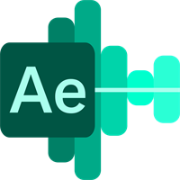

<h1 align="center">Audio Equalizer/visualizer</h1>

A UWP audio equalizer/visualizer for Windows

## Building from the source

1. Prerequisites
    - Windows 10 1809 onwards, or Windows 11
    - Visual Studio 2022 with .NET and WinUI workloads
2. Clone the repository
3. Open the solution with Visual Studio
4. Build the solution

## Screenshots

